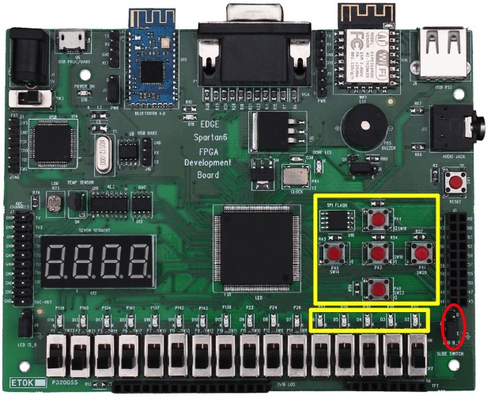

# Railway Track Switching System on Spartan‑6 FPGA

## Overview
A Verilog-based railway track switching controller implemented on a Xilinx Spartan‑6 FPGA using Xilinx ISE.

## Features
- Hardware-safe Verilog `nd.v`
- Testbench `tb_nd.v` for simulation
- Example constraints `constraints.ucf` for Spartan‑6 boards
- Algorithm and reference paragraph for documentation

## Usage
1. Open in Xilinx ISE.
2. Add `src/nd.v` and `src/constraints.ucf`.
3. Simulate using `src/tb_nd.v`.
4. Synthesize and implement.
5. Program the FPGA.

## Notes
Adjust UCF pin mapping as per your FPGA board.
